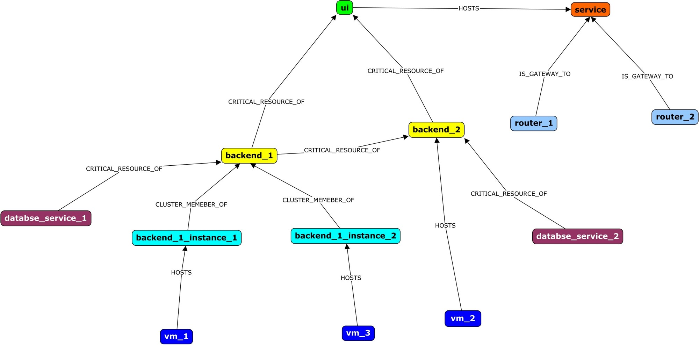

Health State Computation Model
================================================

Problem Statement
########

**Intern Name:** Shivangi

**Mentor:** Dolly

-	**Objective:** Enhance the current health state model to include reachability aspects, behavior model
-	**Approach:** Rule based algorithm (not Pregel based); existing libraries/ technologies can be evaluated for introducing better technologies
-	**Outcome expected:** Backend implementation of Health State Computations model

Technology Stack Used
########

- Scala/Spark
- Pregel

Solution
########

**Current Scenario**

- In our existing model, we are calculating the health state individually for all CIs based on the alerts received. 
- We have pregel funtion for only the health score computation.

**Aim**

- Our aim is to achieve the propagation of these health states genarated on individual CI till the last level.
- Using a rule based approach (Pregel based), we will be propagating the health states of the CIs till the service level.
- We will merge both the Health State and Health Score Computation Algorithms.

**Approach**

We will be using a sample knowledge graph as a reference where we have listed down the CIs and relationship between them.

                                                                      Sample Knowledge Graph

  
  
**Tabular Representation of above sample graph**

For sample date, we are assuming some of the CIs to be in active state which means that they have received some alerts which causes change in their health state. We are maintaining a Set datatype which well serve 2 purposes.

- to store all the health states propagated from different CIs.
- Set will store unique values.

To propagate the health states, we have maintained a rulebook.json file which stores data in the given format.

.. figure:: rulebook.png
    :alt: Process
    :figclass: align-center

Using this 

  

Result
######

