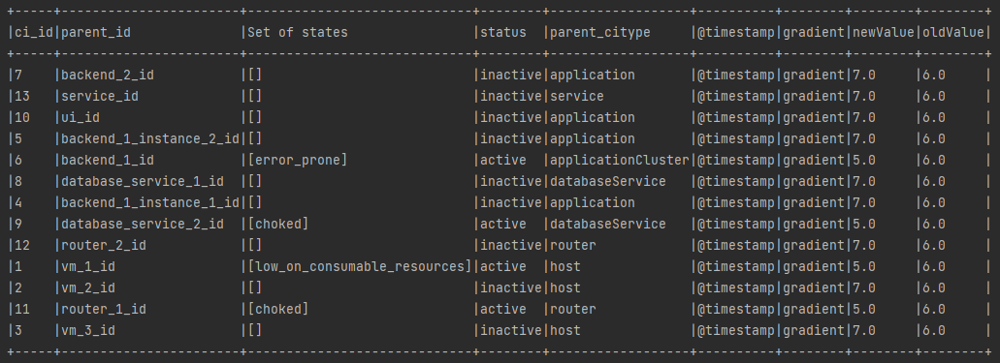
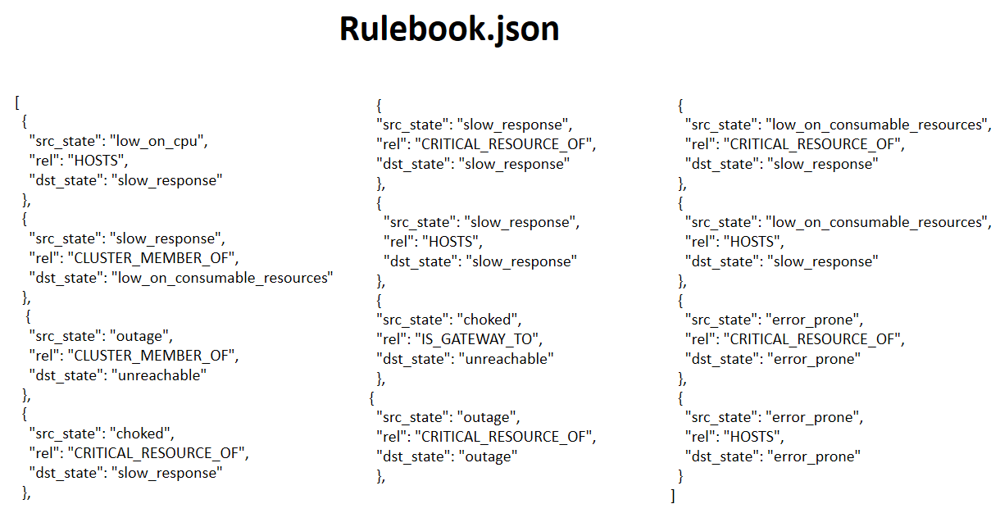
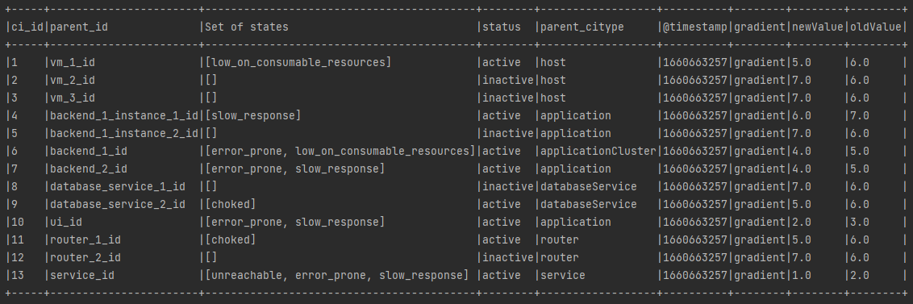
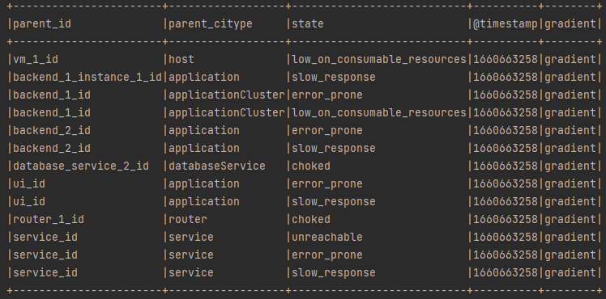

Health State Computation Model
================================================

Problem Statement
########

**Intern Name:** Shivangi

**Mentor:** Prabodh

-	**Objective:** Enhance the current health state model to include reachability aspects, behavior model
-	**Approach:** Rule based algorithm (Pregel based); existing libraries/ technologies can be evaluated for introducing better technologies
-	**Outcome expected:** Backend implementation of Health State Computations Model

**GraphX Programming Guide** - `<https://spark.apache.org/docs/latest/graphx-programming-guide.html>`_

**Pregel API** - https://spark.apache.org/docs/latest/graphx-programming-guide.html#pregel-api

Technology Stack Used
########

- Scala/Spark
- Pregel API

Solution
########

**Current Scenario**

- In our existing model, we are calculating the health state individually for all CIs based on the alerts received. 
- We have pregel funtion for only the health score computation.

**Aim**

- Our aim is to achieve the propagation of these health states genarated on individual CI till the last level.
- Using a rule based approach (Pregel based), we will be propagating the health states of the CIs till the service level.
- We will merge both the Health State and Health Score Computation Algorithms.

**Approach**

We will be using a sample knowledge graph as a reference where we have listed down the CIs and relationship between them.

                                                                      Sample Knowledge Graph

  
  
**Tabular Representation of above sample graph**

For sample date, we are assuming some of the CIs to be in active state which means that they have received some alerts which causes change in their health state. We are maintaining a Set datatype which well serve 2 purposes.

- to store all the health states propagated from different CIs.
- Set will store unique values.

To propagate the health states, we have maintained a rulebook.json file which stores data in the given format.

https://github.com/shivangi-2174/Internal-Documentation-Sample/blob/main/intelligeni-internal-documentation-v0.0.1/docs/source/internship-projects/rulebook.json

Using this rulebook, we are using nested mapping, where our key will be the **source_state** and it will have multiple values which will again be a map having key-value pair of **relationship** and **destination_state**.

- **Map  ( srcState ->  Map  (rel -> dstState)  )**

**Logic Used** 

Logic behind the algorithm is that for each CI in a particular health state, we are checking the value in the map for the src_state as well for the inner map with key as relationship and value as dst_state.

Result
######

- We have successfully propaged the health states of CIs till the service level.
- We have merged both the Health State and Health Score Code.
- Use of external json Rulebook helps us to achieve flexibility and allow us to redefine our rules in future.

**Required Output After running Pregel**

    
**Output for Health State**    
 
 

    
    
**Output for Health Score**  

 

       
