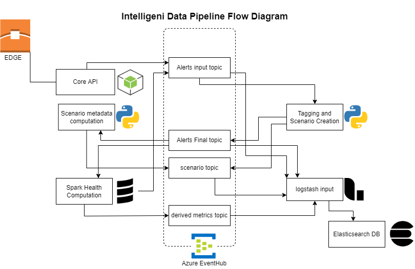

Core Pipelines
================================================

Core pipelines deals with processing alerts that were coming from either edges, or generated by any other process within the core(ex. state change alerts generated by healthstate computation process).Core pipeline has been further divided into sub modules or sub units based on the activity they are performing. Its a layered processing that happens in a definitive order and the data moves along the streams from one topic to the other. Below are the list of processes that constitute the core pipeline processing as whole:

.. toctree::
   :maxdepth: 1

   scenario-creation
   scenario-metadata
   health-computation
   data-persistency-via-logstash

